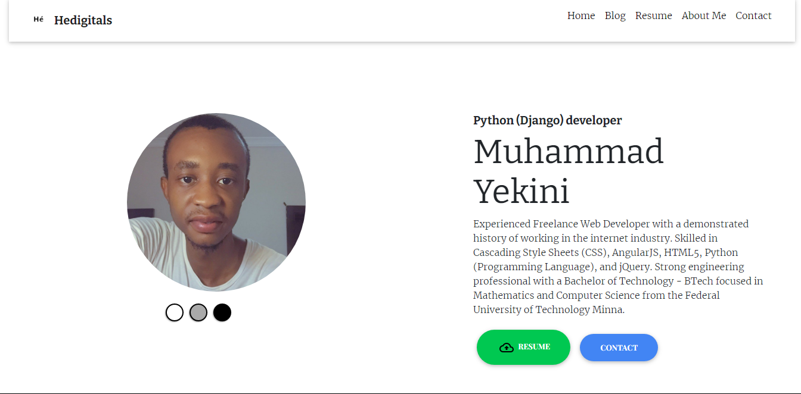
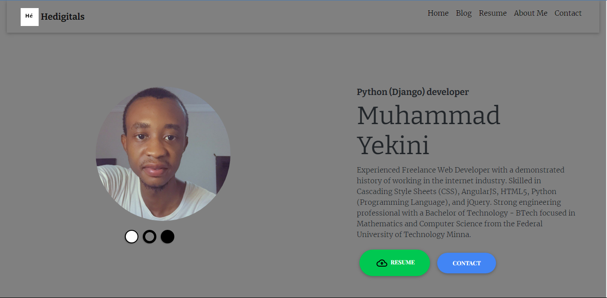
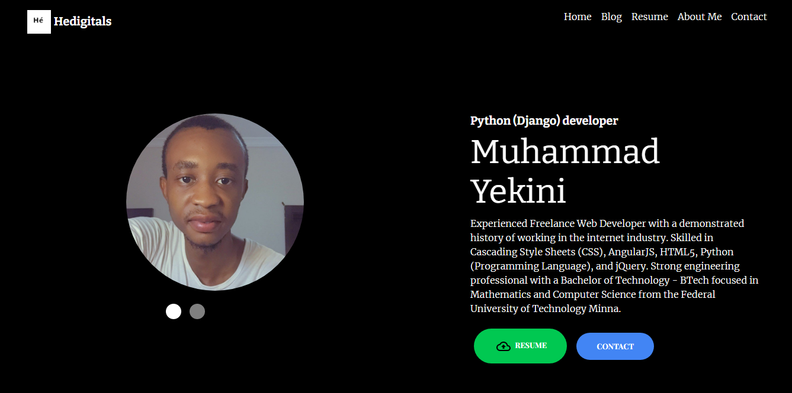

# Portfolio Website

A portfolio website to introduce to potential employers and recruiters About me, skills i'm proficient with and as well my previous experience alongside a preview of projects i've worked on. it details alot of my education background and software development abilities and competence.

## features
Toggling between three (3) themes. Light, Grey and Dark

## Technologies used:
* HTML5
* CSS3
* JAVASCRIPT
* PYTHON
* DJANGO
* SQLite
* HEROKU

## Project Demo
## Installation