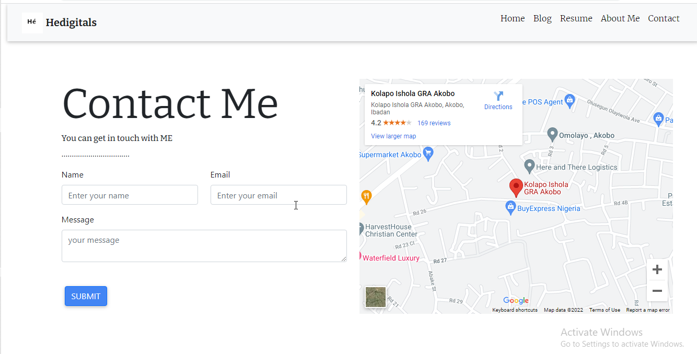

# Portfolio Website

A portfolio website to introduce to potential employers and recruiters About me, skills i'm proficient with and as well my previous experience alongside a preview of projects i've worked on. it details alot of my education background and software development abilities and competence.

## features
* Toggling between three (3) themes. Light, Grey and Dark
* Fully Responsive
*  Built on Bootstrap 5
*  3 Colour Schemes
*  600+ FontAwesome icons


## Technologies used:
* HTML5
* CSS3
* JAVASCRIPT
* PYTHON
* DJANGO
* SQLite
* HEROKU
* 
## Installation
The project includes a requirements.txt file that contains all packages and project dependencies. use python package manager pip

```bash
pip install -r requirements.txt
```
## Usage
run the command to serve fromm local server
```python
python manage.py runserver
```
## Support
for quick support and oppotunities you can contact me via the contact page and socials.



## RoadMap
future releases would include an optimized version of the portfolio integrating new technologies and methods, static and robust to display more advanced Skills and Projects
## Contribution
Interested in contributing? Thanks so much for your interest! We are always looking for improvements to the project and contributions from open-source developers are greatly appreciated. Here's how yo contribute:

1. please open an issue first to discuss what you would like to change.
2. Pull requests are welcome. 

## Author
@myekini

<p align="left"> <a href="https://twitter.com/myekini" target="blank"></a> </p>

<h3 align="left">Connect with me:</h3>
<p align="left">
<a href="https://dev.to/myekini" target="blank"></a>
<a href="https://twitter.com/myekini" target="blank"></a>
<a href="https://linkedin.com/in/muhammad yekini" target="blank"></a>
<a href="https://stackoverflow.com/users/15603225" target="blank"></a>
<a href="https://kaggle.com/muhammadyekini" target="blank"></a>
<a href="https://fb.com/he.digitals" target="blank"></a>
<a href="https://instagram.com/hedigitals" target="blank"></a>
<a href="https://medium.com/@hedigitals001" target="blank"></a>
<a href="https://www.hackerrank.com/myekini1" target="blank"></a>
<a href="https://www.leetcode.com/myekini" target="blank"></a>
</p>


## License
[MIT](https://choosealicense.com/licenses/mit/)